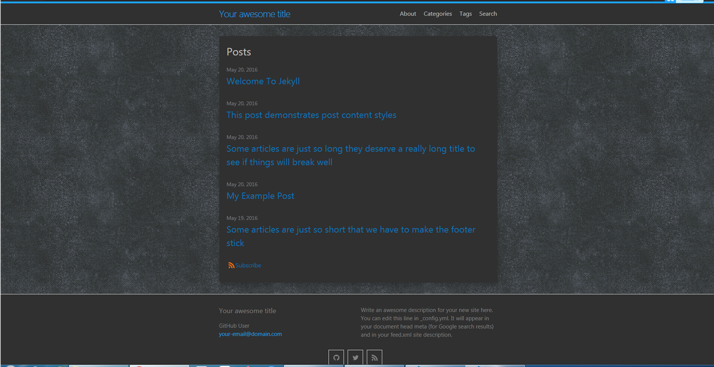

# dark-minima
A dark version of the default theme [Minima](https://github.com/jekyll/minima) of Jekyll.



## Installation

Normally, for installing this jekyll theme into your site, you just need to add `gem 'dark-minima'` to the `Gemfile` and add `theme: dark-minima` to the `_config.yml`. However, if your site is hosted in GitHub Pages, you have to use the [remote theme](https://github.com/benbalter/jekyll-remote-theme).

1. Add the following to your `Gemfile`

    ```ruby
    gem "jekyll-remote-theme"
    ```

    and run `bundle install` to install the plugin.

2. Add the following to your site's `_config.yml` to activate the plugin

    ```yml
    plugins:
      - jekyll-remote-theme
    ```

3. Add the following to your site's `_config.yml`

    ```yml
    remote_theme: songzivong/dark-minima
    ```